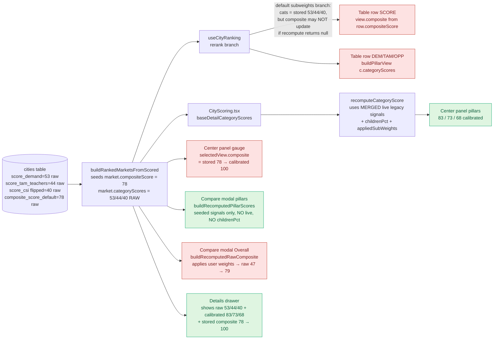
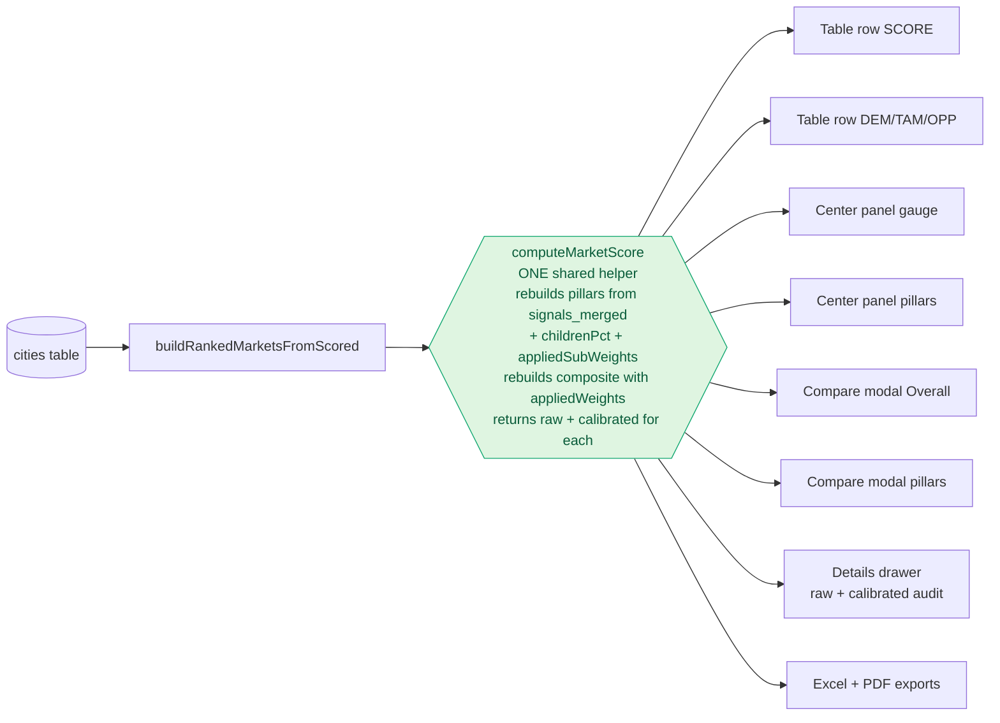

# Nashville score chaos — what's actually happening, and the fix

## The grade-8 explanation (read me first)

Nashville is one city. But the app is currently running **four different score calculators** for that one city, and the screens you opened are each asking a different calculator. That's why the numbers don't line up.

Think of it like four people grading the same kid's report card with slightly different rulebooks:

| Where you look | Who computes the Overall | What "Demand / TAM / OPP" means there | Result you see |
|---|---|---|---|
| **Ranked table row** | Uses the **original Overall already stored in the database** (raw 78) → calibrated → **100** | Reads the **DB-stored pillar values** (already a per-pillar number) → calibrated again → **100 / 79 / 68** | 100 · 100 · 79 · 68 |
| **Center "Selected Market" panel** | Uses the **same stored Overall** (raw 78) → calibrated → **100** | **Re-calculates each pillar from the raw signals**, with childrenPct + live legacy signals layered on → calibrated → **83 / 73 / 68** | 100 · 83 · 73 · 68 |
| **Compare Markets modal** | **Re-calculates the Overall from scratch** using the user's current master weights + sub-weights → raw ≈ 47 → calibrated → **79** | Re-calculates pillars from seeded signals only (no live overrides, no childrenPct) → 83 / 73 / 68 | 79 · 83 · 73 · 68 |
| **Details drawer ("source of truth")** | Shows the stored raw 78 → calibrated → **100** | Shows the **DB raw pillar values** (53 / 44 / 40) and also their calibrated form (83 / 73 / 68) | 100 (raw 78) · 83 raw53 · 73 raw44 · 68 raw40 |

So your three mysteries are explained:

1. **"Row 100/79/68 vs panel 83/73/68"** — the small cells on the row are reading DB-stored numbers that were *already calibrated* (or a different scale) at the source, while the panel **re-derives** them from the raw signals. Two different inputs → two different outputs. My May-27 fix tried to write the recomputed pillars back onto the row, but it only takes effect when the sub-weights are non-default; in the default-subweight branch it just copies the stored values straight through, which is what you're still seeing.
2. **"Compare 79 (C) vs table 100 (A) vs panel 100 (A)"** — the Compare modal is the *only* surface that actually applies your current master weights to the pillars. The row and panel both still display the **stored** composite that was calculated under the default weights at scoring time. So under any non-default preset, Compare drifts down (correctly, by your preset) while row + panel stay frozen at the stored value.
3. **"Drawer raw 53/44/40 vs DB DEM 100"** — the drawer is honest: it shows the true raw values from `score_demand` / `score_tam_teachers` / flipped `score_csi`. The "100" in the row's DEM cell is the *calibrated* projection of a *different* number entirely — it's not raw 53 at all. The two columns aren't disagreeing on the math; they're showing different inputs.

**Bottom line:** four pipelines, three different "Overall"s, two different "pillar" scales — and zero of them is wrong on its own. The bug is that they exist at all.

## Diagram 1 — current state (four parallel pipelines)



Red = uses stored DB values frozen at scoring time, ignores the user's current weights/subweights. Green = honestly reflects the current preset.

## Diagram 2 — proposed state (one shared builder)



Same input → same number on every surface. The drawer's "raw vs calibrated" columns continue to expose the audit trail.

## The fix

1. **Create `src/lib/computeMarketScore.ts`** — one pure helper, returns:
   ```
   { rawPillars, displayPillars, rawComposite, displayComposite, tier }
   ```
   Inputs: a market row, `appliedWeights`, `appliedSubWeights`, optional `childrenPct`, optional `liveLegacySignals` (merged when available).
2. **Pipeline parity** — internally use the same signals merge the center panel uses today (`mergeSignalsPreferLive` + `childrenPct`) so the row, modal, panel and exports all see the *same raw values*. The reason Compare and Panel currently disagree on Overall is purely this: the row & panel use `market.compositeScore` (DB-stored), Compare recomputes. Unify on the recompute path.
3. **Rewire every read site** to call the shared helper and stop touching `compositeScore` / `categoryScores` / `buildPillarView` directly:
   - `src/hooks/citySearch/useCityRanking.ts` — replace the inline rerank branch
   - `src/components/city-scoring/RankedMarketsList.tsx` — SCORE column + DEM/TAM/OPP cells + RowScorePopover
   - `src/pages/CityScoring.tsx` (selectedView + detailCategoryScores) — center panel + gauge + drawer
   - `src/components/city-scoring/MarketCompareModal.tsx` — drop the local `buildRecomputedPillarScores` / `buildRecomputedRawComposite` calls
   - `src/components/city-scoring/MarketDetailDrawer.tsx` + `RowScorePopover.tsx` — show `raw` and `display` straight from the helper
   - `src/lib/cityScoringExport.ts` + `src/lib/compareExport.ts`
4. **Delete the legacy paths** once everyone reads the helper: `recomputedPillars.ts` becomes a thin wrapper or is removed; the "fallback to stored `compositeScore`" branches in `useCityRanking` go away.
5. **Add a render-time drift assertion** like the existing `assertNoCompositeDrift`, but covering pillars too — fail loudly in dev if any surface produces a different number than the helper for the same `(market, weights, subWeights)` triple.
6. **Manually verify on Nashville** with: (a) defaults, (b) Demand-Heavy preset, (c) a custom slider tweak. All four surfaces must show identical Overall and identical DEM/TAM/OPP.

## Risk

Low-to-medium. No DB or edge function changes, no formula changes, no calibration anchor changes. Purely display unification — but it does change what number the **table row + center panel** show under non-default presets (they will start agreeing with Compare modal, e.g. Nashville Overall will drop from 100 to ~79 under a Demand-Heavy preset, which is the *correct* answer per Brett's "one calibrated number everywhere" rule). Worth flagging to Brett before shipping.

## Success condition

For Nashville under any preset/slider combo, all four surfaces report the same Overall and the same DEM/TAM/OPP. The details drawer remains the audit page (raw + calibrated side-by-side) and reconciles against every other surface.
